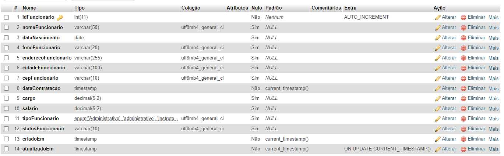
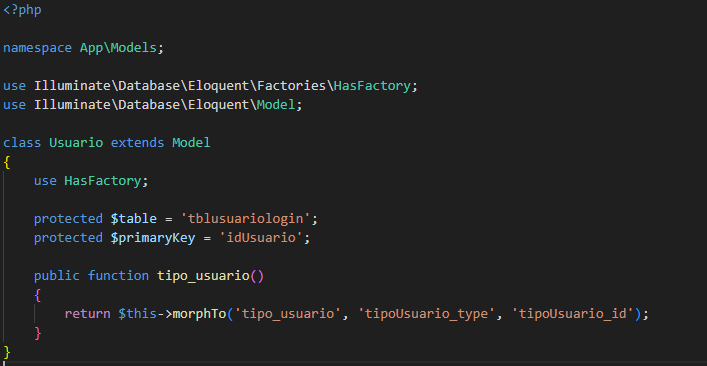
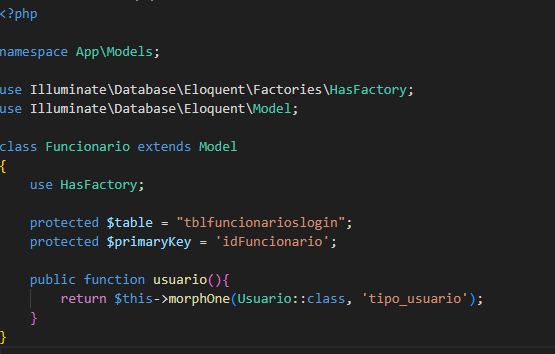
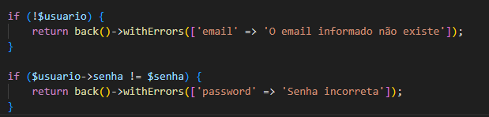
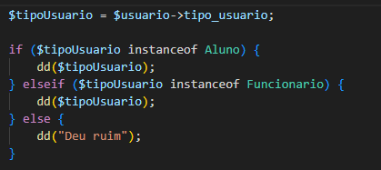

>  # Desenvolvimento de Atividade e Documentação Passo a Passo para Autenticação em Aplicações Laravel e PHP
#
>  #  Introdução
*  ### Esta atividade visa aprofundar e consolidar o conhecimento adquirido até o momento no domínio do processo de login em aplicações web, especialmente utilizando as tecnologias Laravel e PHP. O objetivo principal é fornecer uma oportunidade prática para os participantes desenvolverem habilidades na criação de guias de usuário detalhados e na elaboração de mapas da aplicação, contribuindo assim para uma compreensão mais holística e efetiva do desenvolvimento de software.
#
> # Objetivos Específicos:

* #### 1° Consolidação do Conhecimento: Reforçar e aplicar os conceitos aprendidos sobre autenticação em sistemas web, utilizando as melhores práticas recomendadas pela comunidade Laravel e PHP.

* #### 2° Desenvolvimento de Habilidades Práticas: Proporcionar aos participantes a oportunidade de traduzir teoria em prática, fortalecendo suas habilidades na criação de guias de usuário detalhados, essenciais para facilitar a compreensão e utilização da aplicação.

* #### 3° Utilização de Ferramentas Profissionais: Promover o uso eficiente de ferramentas padrão da indústria, como o Microsoft Word, para a elaboração de documentos técnicos. Isso inclui a criação de um guia passo a passo claro e conciso.

* #### 4° Mapeamento da Aplicação: Incentivar a prática na criação de mapas da aplicação, destacando a estrutura e os fluxos de dados relacionados ao processo de autenticação. Esse exercício visa aprimorar a capacidade dos participantes de visualizar e compreender a arquitetura de uma aplicação de maneira abrangente.

---


> # Download e instalações de ferramentas utilizadas.:

## Composer       <a href="https://getcomposer.org/download/"></a>

* ### Download Composer (versão 2.6.6) para todos os sistemas operacionais e também via código (php).: 
>  <a href="https://getcomposer.org/download/"></a>

* ### Link de download direto à pagina.:

   > <a href="https://getcomposer.org/download/"></a>

* ### Instalação do mesmo:

* #### Após a execução do composer setup

 

#### "Install for me only". 
---

 

#### Aplique a opção de developer mode 

 

#### A partir dai pode continuar aplicando next para as proximas perguntas.

 


---
# Laravel <a href="https://laravel.com/docs/8.x"></a>
* ### Documentação Laravel para duvidas e obtenção do mesmo. OBS(Versão utilizada: 8.x)
> <a href="https://laravel.com/docs/8.x"></a>
* ### Link documentação direto à pagina.:

    > <a href="https://laravel.com/docs/8.x"></a>


---

## XAMPP (Banco de dados MySQL) 

* ### XAMPP. Utilizamos o XAMPP para o acesso ao banco de dados MySQL de forma mais rapida

> <a href="https://www.apachefriends.org/pt_br/index.html"></a>

* ### Link download direto à pagina.:

    > <a href="https://laravel.com/docs/8.x"></a>
---

> # Criação Projeto

## Passo a passo e utilização das ferramentas.:

* ### Primeiro iniciamos o projeto com o framework laravel utilizando o composer com a seguinte linha de código:

#### 1° Abra o terminal.

#### 2° Navegue até o diretório onde deseja criar seu novo projeto Laravel.

#### 3° Execute o seguinte comando para criar um novo projeto Laravel:

```
composer create-project --prefer-dist laravel/laravel nome-do-projeto
```

#### Após a criação do projeto laravel via composer, certifique-se que esta dentro da pasta do projeto, caso não saiba digiteo seguinte comando:

```
ls
```

#### Caso não esteja, digite o seguinte:

```
cd (nome do projeto)
```
---

> # Controller

### Após a criação do projeto, vira os passos para criar o sistema de login dentro do projeto. Comece criando o controller.

* #### O que é um controller
#### No Laravel, um controller é uma classe PHP responsável por manipular as requisições HTTP e controlar o fluxo de uma aplicação. Ele age como uma ponte entre as rotas definidas na aplicação e a lógica de negócios, facilitando a organização e a estruturação do código.

* #### Função
#### A principal função de um controller é receber uma requisição HTTP, processá-la e, em seguida, retornar uma resposta. As ações ou métodos dentro de um controller representam diferentes funcionalidades da aplicação.

* #### O que iremos fazer com os controllers
#### Em nosos projeto utilizamos os controllers para diversas funções, utilizamos para setar uma pagina (blade.php), criamos uma function|função com um nome e chamos a mesma nas rotas, após a rota ser chamada, a função possui uma view e esta view se aponta para a pagina (blade.php)

* #### Exemplo:


#### No exemplo acima, possuo um controller com nome de HomeController, este controller possui uma função e esta função retorna uma view e esta view aponta para um caminho que se encontra esta pagina.

* #### Criação do controller. OBS Sugiro que o nome do controller seja LoginController:

```
php artisan make:controller (Nome do controller).
```

#### Após a criação e a configuração do controller que se encontra dentro da pasta App\Http\Controllers

#### Crie uma view que retorne uma pagina e esta pagina peço que seja construida um formulario. Esta pagina deve ser criada dentro resources/views. Vai do seu interesse de criar uma pasta dentro dela ou somente criar o arquivo a dentro, porém, dentro da function do controller deve apenas apontar o nome do arquivo exemplo.:


---


#### Neste exemplo esse é um arquivo de rotas chamado web.php, ele se encontra dentro da pasta "routes". Como dito antes, esta é um rota que retorna uma pagina por conta da função chamada index dentro do HomeController, esta função aponta para uma view e essa view retorna um caminho onde se encontra a pagina


#### Aqui é para onde a view aponta e aqui também se encontra o arquivo "home".

#### Agora ligando|ativando o servidor do laravel no terminal com o seguinte comando

```
php artisan serve
```

#### O terminal ira retornar um ip de loop com uma porta


#### Seguindo este ip de loop seremos redirecionados a pagina da view
---

> # MySQL

## Passos para realizar o sistema de login

* #### Para construir e usarmos o login, iremos realiza-lo com usuarios dentro do banco de dados, para isso utilizaremos o XAMPP que possui o banco de dados MySQL, após abri-lo e ligar o banco de dados MySQL

* #### Obviamente devemos criar uma tabela para usuarios e preenche-las para o login, caso ocorra alguma duvida de como se deve fazer isso, deixarei uma documentação sobre o MySQL e como acessar o banco de dados local

#### Deixarei uma extensão do Visual Studio Code para realizar a conexão com o banco de dados e criar suas tabelas e diversas outras funções dentro do MySQL.: 
> ### Database Client JDBC

#### Caso não goste, também deixarei a obtenção de um editor de código voltado para o MySQL
> ### MySQL Workbench

* ### Link download direto à pagina.:

    > <a href="https://dev.mysql.com/downloads/workbench/"></a>

### Documentação para criação do banco, tabelas e tuplas (inserts).:

* ### Link documentação MySQL.:

    > <a href="https://www.w3schools.com/mysql/mysql_create_table.asp"></a>
    #### Junto de passo a passo e aulas


#### Após configurar suas tabelas, campos e tuplas, precisaremos de uma pagina (blade.php) que possua um formulario para realizar este login.

> # Formulario

### Para o meu login estarei utilizando este seguinte formulario:


#### Após a criação e configuração do formulario. OBS: Preciso que o "name" das inputs sejam setados


---

>  # Resumo

#### Perceba que o formulario possui uma ação, esta ação sera ativada ao clicar no botão onde há "submit" que aponta para uma rota dentro de web.php, esta rota sera criada dentro do LoginController com uma função|function e dentro da mesma sera criado a autenticação dos valores dentro das inputs e sera comparado com os dados dentro do banco de dados, caso ambas informações sejam iguais, a pessoa realizará o login.

---

> # Criação Model

### Aqui damos inicio aos passos finais. Agora vem a criação dos models para realizar a representação das tabelas dentro do banco de dados.

#### Na aplicação de login apresentada iremos criar um login tanto para os alunos da academia quanto para os funcionarios da mesma, sendo assim devemos possuir 2 tabelas, uma para alunos e outra para funcionario e para realizar o login de ambos, iremos utilizar a tabela de usuarios onde possui as informações para login das mesmas

> # Tabelas

## Tabela Aluno

> 

---

## Tabela Funcionarios

> 

## Tabela Usuario

> 


### Demostrado então as tabelas iremos aos models. Para a criação dos models segue o comando:

```
php artisan make:model (Nome do model)
```

### Crie um para cada tabela (Aluno, Funcionario e Usuario). Os models serão encontrados em App\Models.

> # Configuração de Model

## Como dito antes, o model é uma classe que representa uma tabela dentro do banco de dados (MySQL), para realizarmos a autenticação de usuários precisamos configurar nossos models para que conseguimos realizar a comparação dentro do banco de dados.


> ## Usuario

 ## 

 > ## Aluno

 ## 

 > ## Funcionario

 

 ---
> # Configuração de rota e controller

### Como dito antes, o formulario de login possui um "route" que esta criada no LoginController e setada em web.php

> ## Configuração LoginController

 ### Função view | pagina com formulario

  

 ### Função de autenticação


### Explicação function autenticar

#### Variavel $regras é usada para forçar o usuário a escrever informações dentro das inputs para que o mesmo possa requisitar o login, assim não será executado o login caso os campos estejam vazios

#### Variavel $msg é utilizada para informar esta mensagem ao usuário, os campos são obrigatórios

#### As variaveis $email e $senha recebera através do metodo get os dados que o usuário preencheu dentro das inputs. OBS: o get receberá os dados através das inputs com os names setadas as inputs, exemplo:


---

#### Continuando a explicação sobre a function de autenticação, após as variaveis $email e $senha receberem os valores, criamos uma variavel que se torna um objeto ($usuario) este objeto fara requisição dentro do banco de dados com base no email informado pelo usuario.


---

#### Se o usuário não for encontrado, uma mensagem de erro é adicionada e o usuário é redirecionado de volta à página de login. Em seguida, as senhas são comparadas, e se não corresponderem, outra mensagem de erro é adicionada.



---

#### O tipo de usuário é obtido usando a propriedade tipo_usuario. Dependendo do tipo de usuário, diferentes ações podem ser realizadas. Neste caso, se for um objeto do tipo Aluno, ele será impresso; se for um objeto do tipo Funcionario, também será impresso; caso contrário, "Deu ruim" será impresso.




---

### Para que tudo seja executado, devemos acionar a rota de LoginController chamando pela função de autenticar. Daí partimos para o web.php


#### Damos um nome a esta rota post "/login" e setamos a mesma ao formulario


#### Após o formulario der submit com o botão de Login, a rota é acionada do method POST que chamara a função de autenticar e assim fazendo com que a autenticação seja realizada caso o email e senha estejam dentro do banco de dados.

---
> # Conclusão
#### Após o usuario acionar o botão "submit" o formulario que possui a rota, a function entrará em ação e fara um get através dos names do formulario e passara para as variaveis "email" e "senha". o objeto de usuario fara uma requisição no banco seguindo o email informado, caso ocorra tudo bem, retornara os dados encontrados no banco seguindo o email informado

> ## Array de dados do Aluno


> ## Array de dados do Funcionario


