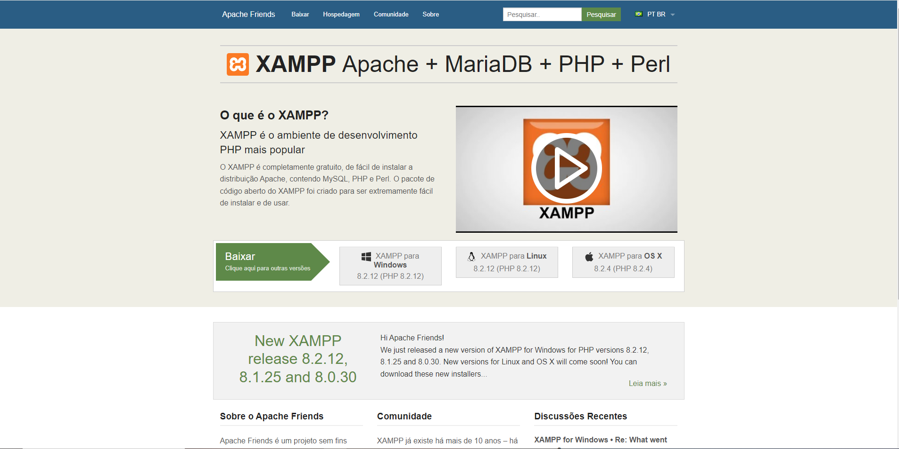

>  # Desenvolvimento de Atividade e Documentação Passo a Passo para Autenticação em Aplicações Laravel e PHP
#
>  ##  Introdução
*  ### Esta atividade visa aprofundar e consolidar o conhecimento adquirido até o momento no domínio do processo de login em aplicações web, especialmente utilizando as tecnologias Laravel e PHP. O objetivo principal é fornecer uma oportunidade prática para os participantes desenvolverem habilidades na criação de guias de usuário detalhados e na elaboração de mapas da aplicação, contribuindo assim para uma compreensão mais holística e efetiva do desenvolvimento de software.
#
> ## Objetivos Específicos:

* #### 1° Consolidação do Conhecimento: Reforçar e aplicar os conceitos aprendidos sobre autenticação em sistemas web, utilizando as melhores práticas recomendadas pela comunidade Laravel e PHP.

* #### 2° Desenvolvimento de Habilidades Práticas: Proporcionar aos participantes a oportunidade de traduzir teoria em prática, fortalecendo suas habilidades na criação de guias de usuário detalhados, essenciais para facilitar a compreensão e utilização da aplicação.

* #### 3° Utilização de Ferramentas Profissionais: Promover o uso eficiente de ferramentas padrão da indústria, como o Microsoft Word, para a elaboração de documentos técnicos. Isso inclui a criação de um guia passo a passo claro e conciso.

* #### 4° Mapeamento da Aplicação: Incentivar a prática na criação de mapas da aplicação, destacando a estrutura e os fluxos de dados relacionados ao processo de autenticação. Esse exercício visa aprimorar a capacidade dos participantes de visualizar e compreender a arquitetura de uma aplicação de maneira abrangente.

---


> ## Download e instalações de ferramentas utilizadas.:

## Composer       <a href="https://getcomposer.org/download/"></a>

* ### Download Composer (versão 2.6.6) para todos os sistemas operacionais e também via código (php).: 
>  <a href="https://getcomposer.org/download/"></a>

* ### Link de download direto à pagina.:

   > <a href="https://getcomposer.org/download/"></a>

* ### Instalação do mesmo:

* #### Após a execução do composer setup

 

#### "Install for me only". 
---

 

#### Aplique a opção de developer mode 

 

#### A partir dai pode continuar aplicando next para as proximas perguntas.

 


---
## Laravel <a href="https://laravel.com/docs/8.x"></a>
* ### Documentação Laravel para duvidas e obtenção do mesmo. OBS(Versão utilizada: 8.x)
> <a href="https://laravel.com/docs/8.x"></a>
* ### Link download direto à pagina.:

    > <a href="https://laravel.com/docs/8.x"></a>


---

## XAMPP (Banco de dados MySQL) 

* ### XAMPP. Utilizamos o XAMPP para o acesso ao banco de dados MySQL de forma mais rapida

> <a href="https://www.apachefriends.org/pt_br/index.html"></a>

* ### Link download direto à pagina.:

    > <a href="https://laravel.com/docs/8.x"></a>
---

## Passo a passo e utilização das ferramentas.:

* ### Primeiro iniciamos o projeto com o framework laravel utilizando o composer com a seguinte linha de código:

#### 1° Abra o terminal.

#### 2° Navegue até o diretório onde deseja criar seu novo projeto Laravel.

#### 3° Execute o seguinte comando para criar um novo projeto Laravel:

```
composer create-project --prefer-dist laravel/laravel nome-do-projeto
````

#### Após a criação do projeto laravel via composer, certifique-se que esta dentro da pasta do projeto, caso não saiba digiteo seguinte comando:

```
ls
```

#### Caso não esteja, digite o seguinte:

```
cd (nome do projeto)
```
---

### Após a criação do projeto, vira os passos para criar o sistema de login dentro do projeto. Comece criando o controller.

* #### O que é um controller
#### No Laravel, um controller é uma classe PHP responsável por manipular as requisições HTTP e controlar o fluxo de uma aplicação. Ele age como uma ponte entre as rotas definidas na aplicação e a lógica de negócios, facilitando a organização e a estruturação do código.

* #### Função
#### A principal função de um controller é receber uma requisição HTTP, processá-la e, em seguida, retornar uma resposta. As ações ou métodos dentro de um controller representam diferentes funcionalidades da aplicação.

* #### O que iremos fazer com os controllers
#### Em nosos projeto utilizamos os controllers para diversas funções, utilizamos para setar uma pagina (blade.php), criamos uma function|função com um nome e chamos a mesma nas rotas, após a rota ser chamada, a função possui uma view e esta view se aponta para a pagina (blade.php)

* #### Exemplo:


#### No exemplo acima, possuo um controller com nome de HomeController, este controller possui uma função e esta função retorna uma view e esta view aponta para um caminho que se encontra esta pagina.
---


#### Neste exemplo esse é um arquivo de rotas chamado web.php, ele se encontra dentro da pasta "routes". Como dito antes, esta é um rota que retorna uma pagina por conta da função chamada index dentro do HomeController, esta função aponta para uma view e essa view retorna um caminho onde se encontra a pagina


#### Aqui é para onde a view aponta e aqui também se encontra o arquivo "home".

#### Agora ligando|ativando o servidor do laravel no terminal com o seguinte comando

```
php artisan serve
```

#### O terminal ira retornar um ip de loop com uma porta


#### Seguindo este ip de loop seremos redirecionados a pagina da view
---

## Passos para realizar o sistema de login

* #### Para construir e usarmos o login, iremos realiza-lo com usuarios dentro do banco de dados, para isso utilizaremos o XAMPP que possui o banco de dados MySQL, após abri-lo e ligar o banco de dados MySQL

* #### Obviamente devemos criar uma tabela para usuarios e preenche-las para o login, caso ocorra alguma duvida de como se deve fazer isso, deixarei uma documentação sobre o MySQL e como acessar o banco de dados local

#### Deixarei uma extensão do Visual Studio Code para realizar a conexão com o banco de dados e criar suas tabelas e diversas outras funções dentro do MySQL.: 
> ### Database Client JDBC

#### Caso não goste, também deixarei a obtenção de um editor de código voltado para o MySQL
> ### MySQL Workbench

* ### Link download direto à pagina.:

    > <a href="https://dev.mysql.com/downloads/workbench/"></a>

### Documentação para criação do banco, tabelas e tuplas (inserts).:

* ### Link documentação MySQL.:

    > <a href="https://www.w3schools.com/mysql/mysql_create_table.asp"></a>
    #### Junto de passo a passo e aulas


---
## Conclusão